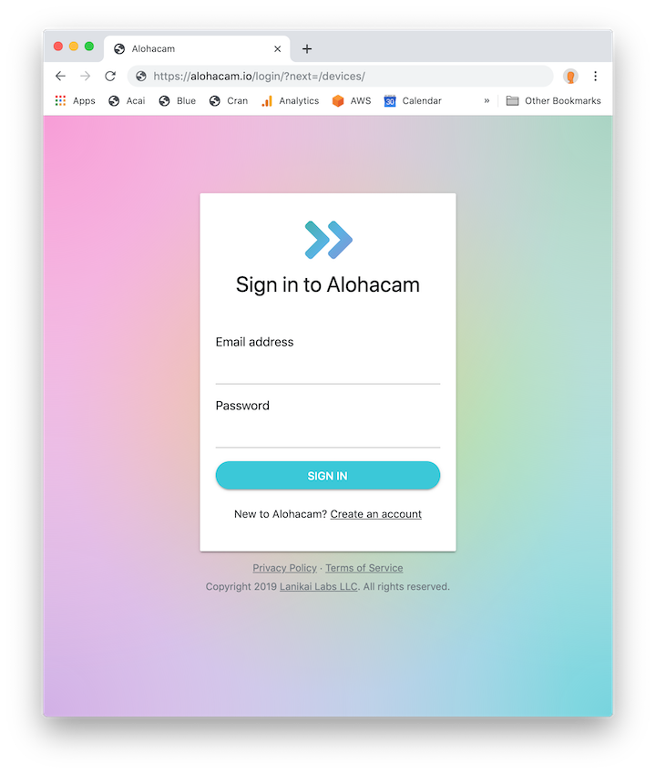
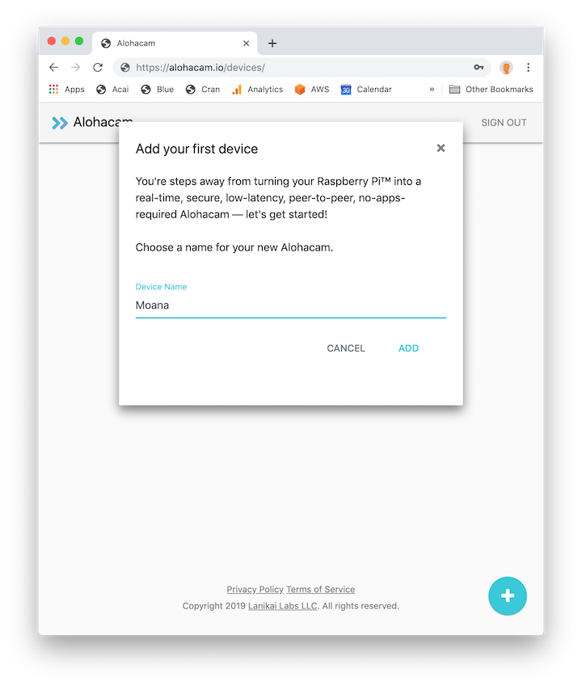
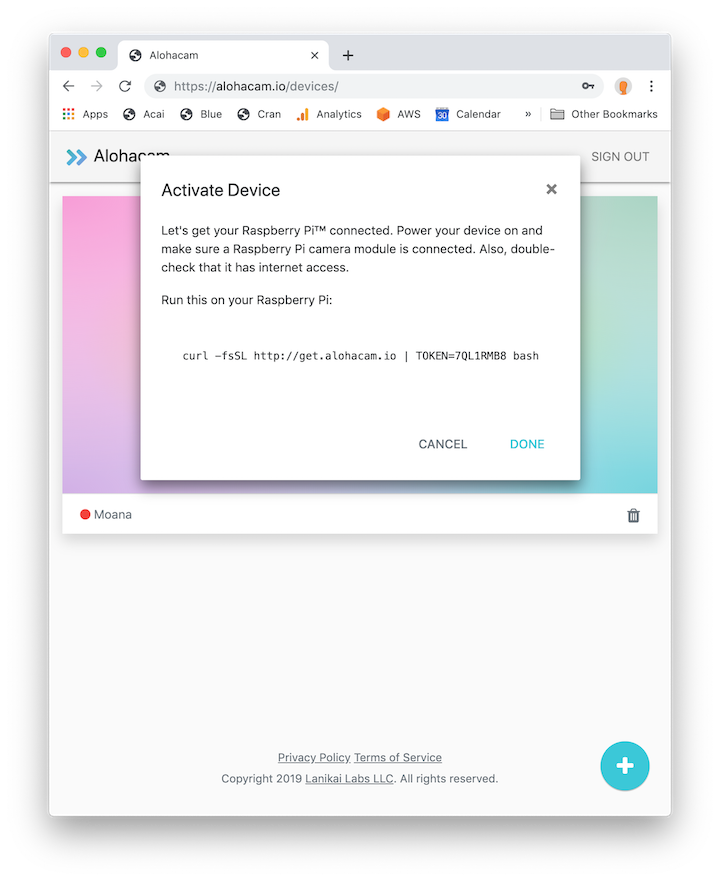

# A beginner's guide to Alohacam:

If you haven't already, request a Beta invite [here](https://lanikailabs.com/alohacam). Once you receive your invite email, click the unique link to register and log into your account. 

You're now ready to add your first device! First, make sure your Raspberry Pi is powered on and connected to the Internet. The main Alohacam webpage should now be displaying the "Add your first device" modal. Choose a name for your Alohacam (like "Moana") and click Add.

 
The modal will now display a command with a unique token. Copy this entire command, and run it on your Raspberry Pi in `$HOME`.

Your Raspberry Pi will now download and configure the Alohacam executable. This may take a minute, so be patient :)
      – If you are prompted to reboot your Pi during this process, choose Yes. Once your Pi reboots and is reconnected to the Internet, run the command ./alohacam to start Alohacam. 
    
After your Pi has downloaded executable and registered the device, click Next. 

You should now be back at the main page, where you can see your Alohacam. 

From this page, you can control your device's live video. Connect to the device, pause, play, full screen, and picture in picture modes are all available from here. 
  If you unplug or power down your Raspberry Pi, you'll need to re-run the ./alohacam command upon boot to restart Alohacam. 

If you run into any issues or still have questions, reach out to us at aloha@lanikailabs.com! 
